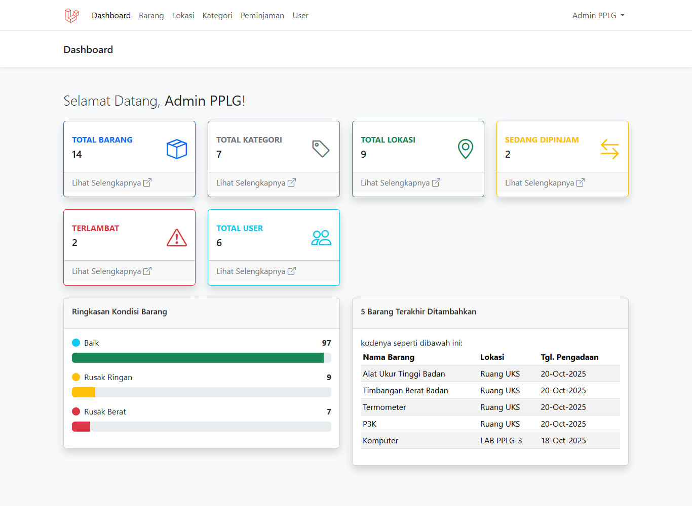

# Invenbar

Invenbar merupakan aplikasi berbasis web yang digunakan untuk membantu pengelolaan data inventaris barang secara digital. Sistem ini dibuat untuk mempermudah pencatatan, pengelolaan, serta pemantauan data barang sehingga proses administrasi inventaris menjadi lebih rapi, efisien, dan terorganisir.

## Fitur Aplikasi
- Dashboard sistem
- Manajemen data barang
- Pengelolaan stok barang
- Pencatatan barang masuk dan keluar
- Laporan data inventaris

## Teknologi yang Digunakan
- Laravel
- PHP
- MySQL
- Bootstrap

## Tujuan Sistem
Aplikasi ini dibuat untuk membantu proses pengelolaan inventaris barang yang sebelumnya dilakukan secara manual. Dengan sistem berbasis web, data barang dapat dikelola dengan lebih mudah, tersimpan dengan aman, serta mempermudah pembuatan laporan inventaris secara cepat dan akurat. Sistem inventaris berbasis web juga membantu meningkatkan efisiensi dalam pengelolaan data barang. :contentReference[oaicite:1]{index=1}

## Repository
Source code aplikasi tersedia di:
https://github.com/Bunga80/Invenbar

## Tampilan Aplikasi

## Developer
Bunga Amelia
